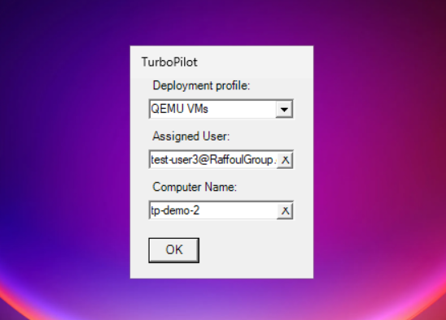

# TurboPilot



TurboPilot is a Windows PowerShell script designed to streamline the process of enrolling devices into Intune Autopilot. It provides a user-friendly GUI for interactive enrollment or can be fully automated for zero-touch deployment scenarios.

In environments where devices are frequently re-imaged or exchanged, manually importing each device's hardware hash into Intune can be time-consuming and inefficient. TurboPilot was created to address this challenge by allowing the technician imaging the device to enroll it into Autopilot simultaneously.

Inspired by the [Get-WindowsAutoPilotInfo](https://www.powershellgallery.com/packages/Get-WindowsAutoPilotInfo/3.9) script, TurboPilot offers several enhancements:

*   **GUI and CLI modes:** Provides an easy-to-use interface for selecting parameters, but also supports full automation via command-line parameters, essential for unattended deployments.
*   **Intuitive Handling of Existing Devices:** Detects if a device is already registered and allows updating its assigned profile, user, or name without fully re-importing the device
*   **Waits for Confirmation:** Verifies that the device registration and attribute updates (profile, user, name) are successfully reflected in Intune before exiting.
*   **Specialize Phase Execution:** Designed to run during the `specialize` phase of Windows Setup (via `autounattend.xml`), ensuring the device is registered with Autopilot *before* the Out-of-Box Experience (OOBE) begins. This can bypass initial OOBE screens like language selection and EULA acceptance. If the selected profile is set to 'self-deploying' mode, Windows will immediately proceed to the enrollment status page allowing for a completely zero-touch experience.
*   **OOBE Manual Execution:** Can also be run manually during OOBE (Shift+F10) for testing or ad-hoc enrollment.

## How it Works

1.  **Module Loading:** When run during the specialize phase, TurboPilot downloads modules to a temporary folder since the environment variables required for module installation are not yet set. When run on a complete OS, it installs them from PSGallery.
2.  **Graph API Connection:** It connects to the Microsoft Graph API.
    *   **Interactive (GUI/Manual):** If run manually during the OOBE without credentials provided, it prompts for interactive login.
    *   **Non-Interactive (CLI/Specialize):** If Tenant ID, Client ID, and Client Secret are provided (as parameters or embedded in the script), it connects silently using an Azure AD App Registration.
3.  **Parameter Collection:**
    *   **GUI Mode:** Presents a form to select an available Autopilot Deployment Profile (filtered to show only those assigned via dynamic groups with a Group Tag), optionally assign a user (with UPN validation and autocomplete), and optionally set a computer name (with validation).
    *   **CLI Mode:** Validates the provided `-DeploymentProfile`, `-AssignedUser`, and `-ComputerName` parameters against Graph API data. Only one of these parameters need to be supplied in order for the script to run in CLI mode.
4.  **Device Import/Update:**
    *   Checks if the device (by serial number) already exists in Autopilot (`Get-AutopilotDevice`).
    *   **New Device:** Imports the device using `Add-AutopilotImportedDevice`, applying the selected Group Tag (derived from the chosen profile's dynamic group assignment rule).
    *   **Existing Device:** If the selected options (Profile/GroupTag, User, Name) differ from the current registration, it updates the existing Autopilot device record using `Set-AutopilotDevice`.
    *   **No Change:** If the device exists and options match, it confirms and exits.
5.  **Verification:** Waits and checks (`Get-AutopilotDevice -expand`) until the device registration details in Intune reflect the requested changes (Profile assignment status, assigned user, display name).
6.  **Cleanup:** Disconnects from Microsoft Graph.

## Usage

TurboPilot can be run in two main scenarios:

### 1. During Windows Specialize Phase (via `autounattend.xml`)

This is the primary intended use case for zero-touch enrollment during OS deployment.

**a) Running from Installation Media:**

1.  Create the path `$OEM$\$$\Setup\Scripts` inside the `sources` directory in your Windows installation media
1.  Place `TurboPilot.ps1` into the newly created `Scripts` folder.
2.  Modify your `autounattend.xml` file to execute the script during the `specialize` pass. Pass the necessary App Registration credentials as arguments:

    ```xml
    <?xml version="1.0" encoding="utf-8"?>
    <unattend xmlns="urn:schemas-microsoft-com:unattend">
        <settings pass="specialize">
            <component name="Microsoft-Windows-Deployment" processorArchitecture="amd64" publicKeyToken="31bf3856ad364e35" language="neutral" versionScope="nonSxS">
                <RunSynchronous>
                    <RunSynchronousCommand wcm:action="add">
                        <Order>1</Order>
                        <!-- Adjust the path as necessary -->
                        <Path>powershell.exe -ep bypass -f C:\Windows\Setup\Scripts\TurboPilot.ps1 -TenantId 'YOUR_TENANT_ID' -ClientId 'YOUR_CLIENT_ID' -ClientSecret 'YOUR_CLIENT_SECRET'</Path>
                        <!-- Optional: Add -DeploymentProfile 'Profile Name' -AssignedUser 'user@domain.com' -ComputerName 'DEVICE-%SERIAL%' -->
                    </RunSynchronousCommand>
                </RunSynchronous>
            </component>
        </settings>
    </unattend>
    ```

**b) Running from a Remote Host:**

1.  Host `TurboPilot.ps1` on a web server accessible during the specialize phase, ensuring upon access the file is shown as plaintext rather than being downloaded
2.  **Important:** For this method, you *must* embed the credentials directly into the script *before* hosting it, or modify the script to retrieve them securely from another source. Find these lines near the end of `TurboPilot.ps1` and uncomment/set them:
    ```powershell
    # If you're calling the script through iex(irm), set the graph connection parameters here:
    # $TenantId = 'your-tenant-id'
    # $ClientId = 'your-client-id'
    # $ClientSecret = 'your-client-secret'
    ```
3.  Modify your `autounattend.xml` to download and execute the script:

    ```xml
    <?xml version="1.0" encoding="utf-8"?>
    <unattend xmlns="urn:schemas-microsoft-com:unattend">
        <settings pass="specialize">
            <component name="Microsoft-Windows-Deployment" processorArchitecture="amd64" publicKeyToken="31bf3856ad364e35" language="neutral" versionScope="nonSxS">
                <RunSynchronous>
                    <RunSynchronousCommand wcm:action="add">
                        <Order>1</Order>
                        <!-- Wait for network, then download and run. Replace URL. -->
                        <Path>powershell.exe -ep bypass -c "do {sleep 1} until (Test-Connection google.com -Count 1 -Quiet); iex(irm http://10.0.2.2/TurboPilot.ps1)"</Path>
                    </RunSynchronousCommand>
                </RunSynchronous>
            </component>
        </settings>
    </unattend>
    ```

### 2. During Windows OOBE (Manual Execution)

This method is useful for testing or manual enrollment scenarios.

1.  Ensure the device has network connectivity.
2.  During the Windows Out-of-Box Experience (OOBE), press `Shift + F10` to open a Command Prompt.
3.  Run the script (assuming it's on accessible media like a USB drive, or download it):
    *   **From USB:** `powershell -ep bypass -f D:\TurboPilot.ps1` (adjust drive letter)
    *   **From Server:** `powershell -ep bypass -c iex(irm http://YOUR_WEB_SERVER_ADDRESS/TurboPilot.ps1)`
5.  The script will launch in GUI mode by default, allowing interactive sign-in to Microsoft Graph and selection of options.
You can run the script multiple times if needed.

### Command-Line Parameters

*   `-TenantId <String>`: (Required for non-interactive/specialize phase) Your Azure AD Tenant ID.
*   `-ClientId <String>`: (Required for non-interactive/specialize phase) The Application (client) ID of your Azure AD App Registration.
*   `-ClientSecret <String>`: (Required for non-interactive/specialize phase) The Client Secret for your Azure AD App Registration.
*   `-DeploymentProfile <String>`: (Optional) The exact display name of the Autopilot Deployment Profile to assign. The script validates that the profile exists and has a group tag assigned via a dynamic group.
*   `-AssignedUser <String>`: (Optional) The User Principal Name (UPN) of the user to assign to the device (e.g., `user@yourdomain.com`).
*   `-ComputerName <String>`: (Optional) The desired computer name for the device (max 15 chars, letters, numbers, hyphens only).

## Azure AD App Registration Setup (for Non-Interactive Use)

To run TurboPilot non-interactively (e.g., during the specialize phase or via CLI), you need an Azure AD App Registration with specific permissions to allow the script to authenticate and manage Autopilot devices.

1.  **Navigate to Azure AD:**
    *   Go to the [Azure portal](https://portal.azure.com/).
    *   Search for and select "Azure Active Directory".
2.  **App Registrations:**
    *   In the left navigation pane, click on "App registrations".
    *   Click "+ New registration".
3.  **Register an Application:**
    *   **Name:** Give it a descriptive name (e.g., "Intune Autopilot Enrollment Script").
    *   **Supported account types:** Select "Accounts in this organizational directory only (Your Tenant Name only - Single tenant)".
    *   **Redirect URI (optional):** You can leave this blank for this type of application.
    *   Click "Register".
4.  **Record IDs:**
    *   After registration, you'll be taken to the app's overview page.
    *   Copy the **Application (client) ID** and the **Directory (tenant) ID**. You will need these for the `-ClientId` and `-TenantId` parameters (or to embed in the script).
5.  **Create a Client Secret:**
    *   In the left navigation pane for your app registration, click on "Certificates & secrets".
    *   Under the "Client secrets" tab, click "+ New client secret".
    *   **Description:** Enter a description (e.g., "TurboPilot Secret").
    *   **Expires:** Choose an expiry duration (e.g., 6 months, 12 months). **Important:** Remember to renew the secret before it expires!
    *   Click "Add".
    *   **Immediately copy the secret's *Value***. This is the *only* time you will see it. Store it securely. This value is needed for the `-ClientSecret` parameter (or to embed in the script).
6.  **Assign API Permissions:**
    *   In the left navigation pane, click on "API permissions".
    *   Click "+ Add a permission".
    *   Select "Microsoft Graph".
    *   Select "Application permissions" (since the script runs without a signed-in user).
    *   Search for and add the following permissions:
        *   `Device.ReadWrite.All`
        *   `DeviceManagementManagedDevices.ReadWrite.All`
        *   `DeviceManagementServiceConfig.ReadWrite.All`
        *   `Group.ReadWrite.All`
        *   `GroupMember.ReadWrite.All`
        *   `User.Read.All`
    *   Click "Add permissions".
7.  **Grant Admin Consent:**
    *   After adding the permissions, you (or an Azure AD administrator) must grant consent for your tenant.
    *   Click the "Grant admin consent for [Your Tenant Name]" button.
    *   Click "Yes" to confirm.
The status for all added permissions should now show a green checkmark and "Granted for [Your Tenant Name]".

Your App Registration is now configured. You can use the recorded Tenant ID, Client ID, and Client Secret with TurboPilot for non-interactive authentication.